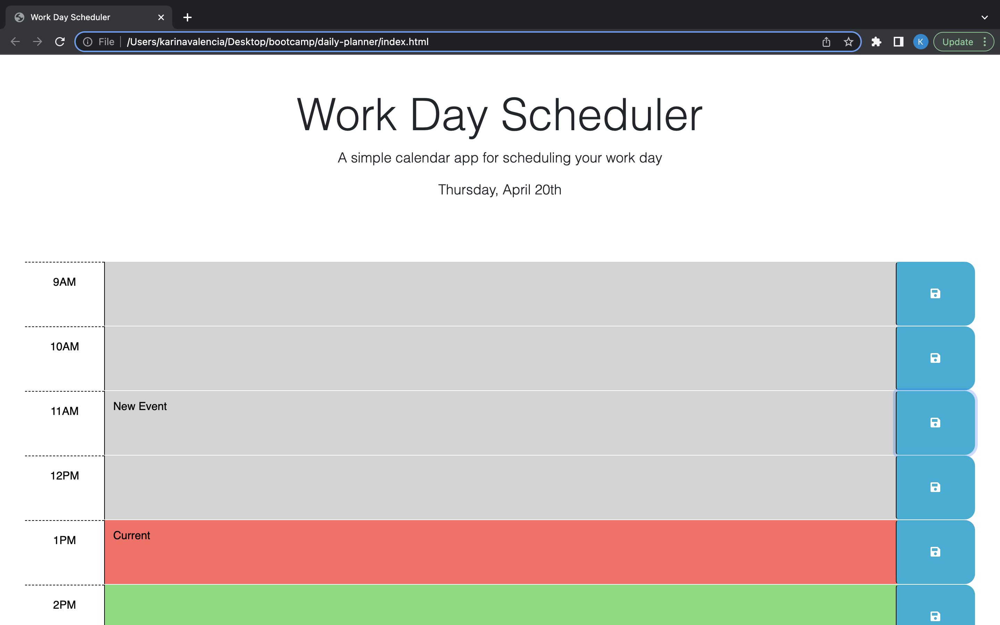
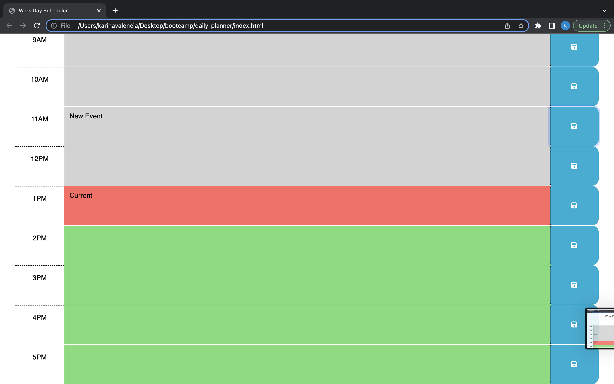

# Daily Planner

Work day scheduler.

## Description

This website shows the current day at the top of the calendar then shows the times of the day in blocks below it. Depending on the color of the block it will show what times have passed and what time it currently is on. Events can be added and changed which will still be saved even when the page is refreshed.

## Getting Started

### Dependencies

* MacOS
* Windows 10

### Installing

[Repository](https://github.com/Valencia01/daily-planner)

### Executing program

[Pages](https://valencia01.github.io/daily-planner/)

## Author(s)

Karina Valencia

## Version History

* 0.1
    * Initial Release

## License

This project is licensed under the MIT License - see the LICENSE.md file for details

## Acknowledgments

Georgeyoo: Provided starter code

## Deployed Program

